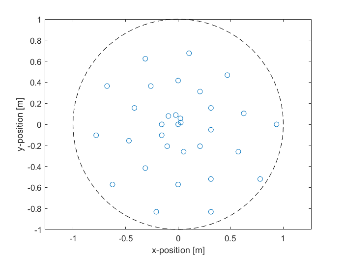

# AdvancedAircraftNoise

This repository contains the code developed during for the follow-up course advanced aircraft noise (AE4463P-23) as part of the control and operations master within TuDelft. The course was a mixture between lecture and practical work. In which various topics related to (aircraft noise) were treated. Such as simulation, predicting the location of the noise source and frequency analysis. 

## Outline

1. [Aircraft Flyover](https://github.com/JoshuaBog09/AdvancedAircraftNoise/blob/main/assignment1/Advanced_Aircraft_Noise_Assignment_1.pdf): Within assignment one, pressure measurements for an aircraft flyover were provided. The main goal of the assignment was to experiment with the spectrogram/ and fourier transformation. And to then observe the various the effect of time and frequency resolution, and how the sample frequency effects effects the these parameters. Besides that the power spectral density(PSD) of the signal was analyzed and terms such as single and two sided PSD were introduced. Lastly within this report various sound metrics were investigated.

2. [Discrete Fourier Transformation](https://github.com/JoshuaBog09/AdvancedAircraftNoise/blob/main/assignment2/Advanced_Aircraft_Noise_Assignment_2.pdf): Within assignment two the focus was laid onto the discrete fourier transformation (DFT). Trough the use of a DFT a signal can be analyzed, to investigate its frequency properties. Such as which frequency is dominant within the analyzed signal. However a range of shortcomings where found, when immediately utilizing the DFT, the shortcomings mainly come from effects also observed within assignment 1. The sample frequency effects the resolution of the analysis which can be performed. Therefore to try improve the resolution, procedures such as zero padding and hanning weighting were introduced.

3. [Aircraft Noise Prediction Program](https://github.com/JoshuaBog09/AdvancedAircraftNoise/blob/main/assignment3/Advanced_Aircraft_Noise_Assignment_3.pdf): This assignment completely moves away from the fourier transformation topics explored within the previous two assignments. Within the assignment the focus was put onto the prediction of noise generation, created by various aircraft components. The model is based on the ANOPP model developed by NASA, however for the matlab implementation a summary provided by the professor was utilized. After the implantation of the model a comparison was made to measurement data to observe the behavior, and potential differences.

4. [2D Beamforming](https://github.com/JoshuaBog09/AdvancedAircraftNoise/blob/main/assignment4/Advanced_Aircraft_Noise_Assignment_4.pdf): The first of a two part assignment relating to beamforming. Beamforming can be an incredibly powerful tool, to investigate where a sound source is located. However before it can be utilized, it is important to realize that not all beam formed data can be used effectively. This data is not necessarily wrong, it is more an artifact/ consequence of the modelling method. Within this assignment a beamform procedure was performed on under water sound measurements.

5. [3D Beamforming](https://github.com/JoshuaBog09/AdvancedAircraftNoise/blob/main/assignment5/Advanced_Aircraft_Noise_Assignment_5.pdf): (My personal favorite assignment). Within this assignment similar methods to assignment 4 was used, however now the a three dimensional sound measurement array was used. By smartly delaying an summing the various output it is possible to determine the location of a frequency dependent sound source.

|**High Frequencies** | **Low Frequencies** |
:-----:|:-----:
 |  

|**Microphone array**|
:----:
||

6. [Practical](https://github.com/JoshuaBog09/AdvancedAircraftNoise/blob/main/assignment5/Advanced_Aircraft_Noise_Assignment_5.pdf): Within the last assignment of the course a more practical approach was taken. Here various circuits were analyzed for there phase, and gain behavior as a function of frequency. With the end of goal of constructing a filter.

## citation
- Prof. dr. ir. M. Snellen Prof. dr. D.G. Simons. Digital Signal Processing an introduction. Delft, Netherlands:
TU Delft, Dec. 2023.
- Prof. dr. ir. M. Snellen Prof. dr. D.G. Simons. An introduction to general acoustics and aircraft noise. 1th
ed. Delft, Netherlands: TU Delft, 2023.
___